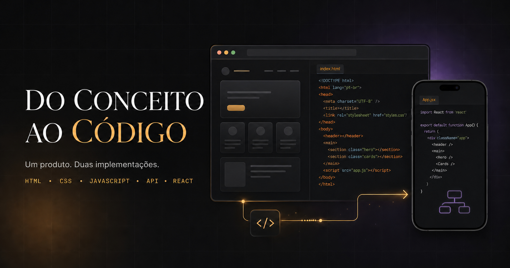

# Do Conceito ao Código

Uma iniciativa prática e não oficial entre colegas durante a formação Full Stack da [Toti](https://totidiversidade.com.br/). A proposta é escolher um tema e um layout e desenvolver o mesmo projeto aos poucos, aplicando o que aprendemos em cada etapa, até chegar a duas versões: uma com JavaScript puro e outra com React.

[**Acessar a página publicada**](https://vat-ua.github.io/do-conceito-ao-codigo/)

## A proposta

Cada pessoa pode adaptar a proposta ao próprio ritmo, escolher o tema e decidir até onde levar o projeto. É um ponto de partida para praticar, experimentar e trocar experiências entre colegas.

## Sobre este site

Este repositório contém a página que apresenta a iniciativa, suas etapas sugeridas e alguns caminhos para começar. A interface foi desenvolvida com React, TypeScript, Vite e CSS.
